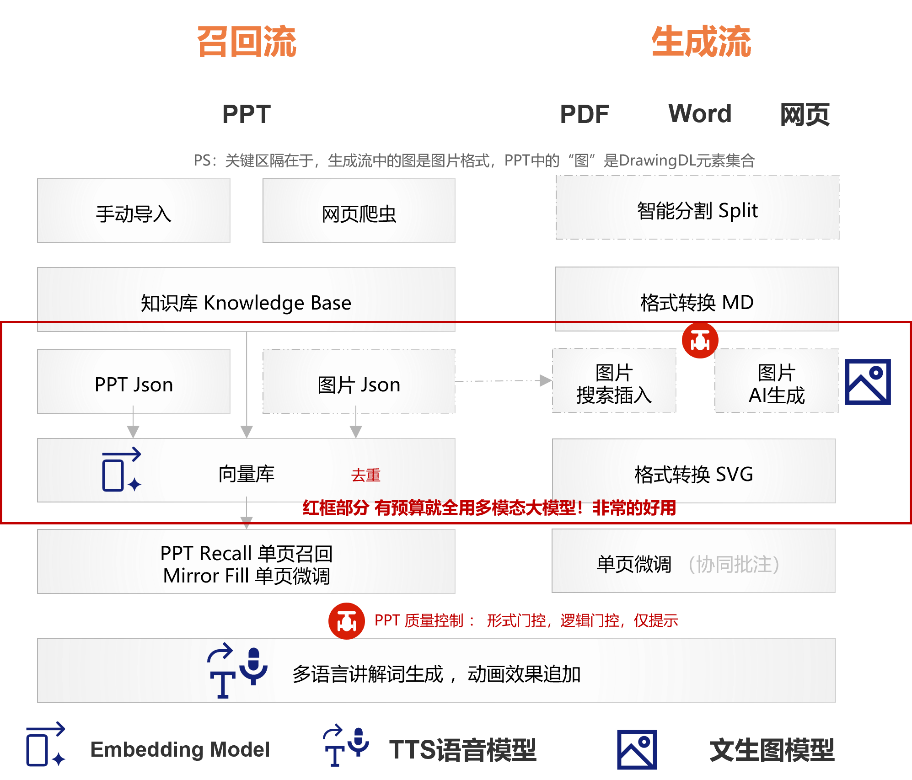

# DeePPT — 企业级 PPT 智能召回与生成工具

 **基于企业内部存量 PPT 素材，实现 索引构建、精确/模糊检索、局部编辑、模板填充、多模态生成及质量门控，助力团队高效复用和创作演示文稿。** 

兄弟们，还有人记得我写的 《从入门到入土，30分钟学会写材料并汇报》么。 浏览量终结在19.9w ，并没有突破20W浏览量略有遗憾，今天给大家带来AI时代的改版。
没有时间进一步优化了，主要是我收到了一份长达一个屏幕的PPT修改意见，我觉得我一个月都改不完。 产品优化，哪有终点呢？眼前PPT工具这个事儿必须收束了。

## 场景说明 没遇到这个工作场景，后面的就不需要看了

1. 找PPT材料，微调 ：“XX你去写这部分材料，里面的XX部分你去找谁谁要一下，然后把这页定制化成CC客户”
2. 找文本材料，生成PPT ：“这次的客户对技术要求比较高，有一个特性在白皮书里，把这个产品特性写成一个ppt”
3. 整个PPT都自己写： 通常都跟华为的业务没关系。 

下面是对应的提示词

1. “我把ppt放到了 knowledge base这个文件夹，使用 PPT Recall 构建索引， 为我找到一页包含 XX解决方案架构图 的PPT，然后输出” “ 使用 mirror fill  为我找到一页 包含 XX产品能力介绍 的ppt ，然后把其中的三条优势换成 NN产品的三条优势”“使用LLM search 构建好向量库、为我找一页 XX产品的介绍；为我找一个 XX产品的高清图片”
2. “我把XX材料放到了 Project1文件夹， 使用split pdf对材料进行分割，然后把第1部分生成一个图文混编的材料，图片来自pdf文档 ”
3. “这是一个图文混编的网页 XX ，请基于该材料生成一个图文混编的ppt ， 图片完全使用网页中的高清图” （简单来说，不需要权威性，咋写都没人挑战你）

## 安装，调试，使用，以及报错处理  用Agent平台解决所有的问题 ，解决不了就换个更好的模型（至少要deepseek v4 pro），还不行就换平台
用魔法对抗魔法，用AI解决AI。 直接找一个Agent平台，claw也好，hermes也好，我推荐腾讯的workbuddy，因为这个平台可以免费的薅羊毛，领150个积分，用一个好一点的模型进行测试。
把skill的网页链接交给任意一个agent平台，让agent平台完成安装后，进行测试。报错了，就让平台自己修复。

 ** 如果这一步测试都没看到预期的效果，也不用往下看了 **
 
## 产品设计原则 读书人的事儿，能叫抄么？

1.  **把存量的知识用好比什么都强** ：天下文章一大抄，无论是这个skill还是PPT。有人写过的东西绝对不自己动手，对ppt格式部分的项目已经很多了， **就直接复用PPT-Master https://github.com/hugohe3/ppt-master**  。PPT已经有人写过了，那就直接拿过来改改。
2.  **尽量引入模型的能力，而非代码** 。  **固定化的代码只为了解决一个问题，就是减少上下文的消耗，原则上我们希望大模型能够解决一切问题** 。 比如，我想要从一个ppt里分割出一个架构图，这对代码来说就很难，构建多维度的向量库也不容易，但是对于 生图大模型来说就很简单，但可惜兄弟财力不足，只能用代码来凑合凑合。并没有优化这部分的代码，
因为没有意义，资本有的是钱，总有人会不计成本的用大模型解决这个问题的。 
3. 原子化可组装的设计。 尽量让每一个功能模块都能单独测试，可以平滑的进行替换。 通过自然语言的描述组装工作流。

## 产品定位  ： 归根到底都是排序算法
1. 给客户证明，基于当前的大模型能力，中小企业缺乏技术背景的人也能自行开发基础的软件。 面向中小客户，所以要控制成本，利用分割减少上下文，利用免费的模型，尽量不使用生图模型，而是下载，搜索，和复用。尽量不用多模态模型去搜索提取“架构图”，而是用关键词+向量库去构建。
2. 表达一下自己对PPT相关工作的想法。 形式不重要，找到有背书的历史材料才重要。很多类似的工作都围绕着生成一个炫酷，风格独特的PPT，实际上在企业级办公根本没有意义。 对于公司的大部分角色，你遇到的ppt工作无非就是，“要一份PPT并调整，合入，编排逻辑” “把一个PPT改成黑底的，翻译成英语的” “基于评审意见一遍一遍修改”“把一部分信息修改为PPT格式”
。能把这些琐事闭环，就不错了。

解释了产品设计原则和产品定位，其实就是个免责声明，当遇到用户来挑战 “老板，你这产品XX能力也不行啊” ，  **都回自动通过原则和定位来狡辩，“哦，因为我们的人力和定位限制，导致我们现在还没有XX” “在我的环境是没问题的，可能是你的环境 大模型不行，agent平台不行。。。”** 

## 工作流描述 能搜就搜，搜不到且是不是技术交流客户交流的场景，就生成

整个skill仓库分成 召回流，和生成流。 通过门控对整体进行质量控制，支持对任意节点进行基于自然语言的工作流编排。 
- 召回流 
    数据收集，可以自己向 knowledge base文件夹中导入pptx材料，同时也写了一个爬虫，但是只在外网一个特殊的网站上进行测试，公司内部没测试过，担心会有安全风险。 我的数据库构建大概有30页的公开脱敏数字混淆材料。 包括 趋势，痛点等宏观洞察，客户案例，解决方案说明，产品能力说明，等类型的材料。 导入文件夹后，可以通过ppt recal ，image extract等文件夹下的index.py 生成基于文本的json文件，实现了基于关键词的搜索。 同时 还有一个 LLM Search 的文件夹，可以基于json文件，和源文件对ppt单页和图片进行向量化 。 后面可以基于向量的方式进行搜索。 搜索召回的材料，最好可以原样直接使用。 ** 如果涉及到微调的话，当前的能力也只能对一些规范的，不复杂的材料进行修改。 比如 左边是架构图，右边是标准的三个优势，这种还能处理一下，如果右边的文字组成特别复杂，填充时必然混乱。 **  这里就要引出一个历史工作，其实tools文件夹里 ，有个 style convert的能力，基于相同的思路，背景完全不改，只改文字和风格，特别适合我们 “黑白底转换和翻译”这两种场景，但是依赖大量的训练集，所以效果不是很好。 
- 生成流
   **  1. 输入材料无PPT ** ：最建议的使用方式就是 **，上传一个已经包含了优质图片的材料，网页链接，pdf ，word 这种都可以，或者说这种更好，因为图片就是图片，代码有能力识别和提取。 **  使用 split pdf进行分割，这一步是为了节省上下文，我曾经测试过180页的材料，ppt里输出的信息就都是一堆奇怪的数字了，但是处理5页的pdf，直接生成pptx效果就比较好。 然后直接要求生成一个图文混编的模型， **一定要对图片有明确的要求。** 或者说 对于所有增值特性，包括 动画，多语音配音，翻译都要明确指定。
     **2. 输入材料有PPT**  ： 这种通常就是公司经常搞的，华为风格的ppt skill 。 我就不理解这玩意搞了有啥用。。。  这种传入一个pptx （其他格式也可以，但是只能学配色），指定 "使用/create template 为 导入的 XX文件，生成一个模板” 模板生成后“使用XX模板，生成一份XX PPT，要求有图文混编”。

- 输出门控： 有一个形式门控。就是让pptx形式美观的。 本次新增了一个 逻辑门控，可以说是一个质量报表。 本质是把一堆要求转化为json文件，然后用json文件对pptx进行排查 。 举个例子，“这个材料没有观点啊” “这个材料没有逻辑啊” “材料里有历史信息没去除啊” 这种都可以搞一个门控，用它来控制，这里也没进行广泛的测试。 只是传达一个思路，就是对于不同类型的材料，自然有不同类型的逻辑，最简单的  病药效 ， 缺了哪个都不行。  “没有观点” 那就是没有动词，只是在客观描述，领导不知道谁来干什么，这种就有一个弱标题排查。 因为大家都习惯复制一个材料修改，那可能就有遗留的信息没去除，这部分走的是聚类逻辑，如果一个材料中存在一个词，明显就不聚类，那么就需要提示删除。 
    你可能也注意到了，这里涉及到超参数的配置，但超参数是需要调节的，你收到了100条弱标题告警也不要奇怪，调整一下参数就好了。 而且对于同类的告警，给出了一个折叠。防止告警泛洪。

## TO DO List ： 大模型 和超参数 

1. 引入一个多模态大模型，处理和图片相关的所有流程，用token去解决一切问题。
2. 引入Loop环节，对输出进行标注，反馈调节超参数。 
3. 向量构建优化。 （其实没什么太大的意义，回退到8年前的方向了）

---

## 功能总览
所有脚本与模块基本均位于 `skill/scripts/` 目录下。

| 模块                   | 功能简述                                      | 代码入口 (skill/scripts/) | 成熟度               | 待补齐能力           |
|----------------------|-------------------------------------------|---------------|-------------------|-----------------|
| 网页爬虫                 | 递归抓取指定 URL 下的 PPT 文件，按标题关键词过滤下载           | `web_ppt_crawler/` | ⚠️ 未大规模测试         | 稳定性增强、断点续传      |
| 知识库监控                | 常驻程序监听 Knowledge Base 文件夹变化，自动触发索引        | `watcher/`    | 🟡 未大规模测试         | 增量索引、冲突处理       |
| PPT 精确索引             | 将知识库中每页 PPT 转为 JSON 索引，支持关键词精确检索          | `PPT_Recall/` | ✅ 可用              | 多语言 OCR         |
| 图片精确索引               | 从 PDF/Word/PPT 中提取有上下文的完整图片，建立 JSON 索引    | `Image_extract/` | ✅ 可用              | 图片去重            |
| PDF 语义分割             | 基于语义和后端模型自动切割 PDF，保证材料高质量                 | `pdf_split/`  | ✅ 可用              | 切割参数自适应         |
| 向量模糊检索               | 基于 FAISS+SQLite，对 JSON 索引或源文件进行向量化，支持语义搜索 | `LLM_Search/` | ✅ 小规模测试 (30+ PPT) | 超参数自动调优、标注反馈微调  |
| 局部内容编辑 (Mirror Fill) | 对结构简单的 PPT 页（如左图右文）保持图形不变，仅替换文字           | `mirror_fill/` | 🟡 有限场景可用         | 复杂布局适配          |
| 模板提取与生成              | 基于 PPT 模板生成新 PPT                          | `generation/` | ✅ 可用              | 多模态模型集成、语音克隆    |
| 语音图文多模态              | 支持多模态配图（SVG，img）本地互联网搜索+生成，和配音（TTS）       | `image_gen/`  | ✅ 可用              | 导入模型后测试         |
| 在线预览与协作              | Flask 网页服务，支持公网发布和团队协作编辑                  | `web_preview/` | ⚠️ 无公网 IP 测试不充分   | 协同编辑、权限管理       |
| 质量门控                 | 形式门控（SVG/PPTX 格式校验）+ 内容门控（逻辑、完整性检查）       | `quality_checker/` | 🟡 导入专家知识优化       | 内容门控规则库、自定义校验条件 |

 子功能调试，对代码有一定了解：在正确环境变量，路径下 执行对应的代码。部分文件夹下有 readme说明如何使用cli 例如 
    - python mirror_fill/auto_fill.py "AI存储解决方案"  "块1\n111\n222"   "块2\n333\n444"   "块3\n555\n666"  
    - speaker notes → 语音 python skills/ppt-master/scripts/notes_to_audio.py projects/my-deck
    - 自定义动画  python skills/ppt-master/scripts/pptx_animations.py projects/my-deck

### 图片获取  有没有图，是一个材料看起来好不看的重点！ 一定要有图

非用户自带图片有两条路径，可在同一份 deck 里按行混用：

需要 API 的功能统一通过 .env 配置。clone 安装可以用 cp .env.example .env；skill marketplace 安装建议使用持久的用户级配置：

mkdir -p ~/.deepppt
cp /path/to/installed/deepppt/.env.example ~/.deepppt/.env
PPT Master 会优先读取当前进程环境变量，然后按顺序读取第一个存在的 .env：当前工作目录、clone 仓库根目录、~/.deepppt/.env。

A) AI 生图 
    — image_gen.py。设置 IMAGE_BACKEND 和对应 *_API_KEY（OPENAI_API_KEY、GEMINI_API_KEY 等），流程会自动调用。python3 skills/deepppt/scripts/image_gen.py --list-backends 查看完整后端清单。gpt-image-2 目前综合质量最佳。
    — svg_gen.py 这是一个兜底策略，使用文本大模型 生成一个base64的图，丑的不行，还不如没有，就是证明一下能生成插入廉价图片。
B) 搜索 
    网络搜索 — image_search.py。零配置可用，但高质量使用建议配置 PEXELS_API_KEY / PIXABAY_API_KEY（都免费申请）。不配置时只使用 Openverse / Wikimedia Commons，适合作为兜底，但容易出现普通用户上传、构图随意、清晰度不稳定的图片；配置后默认搜索链会追加 Pexels / Pixabay，现代商业摄影、人物、办公、生活方式和插画类图片质量会明显更稳定。默认以图片质量和匹配度优先，直接把 CC0、公有领域、Pexels / Pixabay 免署名许可、CC BY、CC BY-SA 一起纳入候选；如果选中的图片需要署名，Executor 会在该幻灯片自动添加小字署名。只有明确不能出现署名时，才使用 --strict-no-attribution 限制为免署名图片。对视觉要求高的封面、产品图、人物图和品牌场景，优先级建议是：用户自带高清素材 / AI 生图 > 配置 Pexels / Pixabay 的网络搜索 > 零配置网络搜索。完整说明：image-generator.md（AI）·image-searcher.md（网络）。
    本地搜索，在知识库的构建过程中，存在一个 image_extract 的环节，把图片提取出来，进行index，其实是个过程中的功能，但是也没删掉（删了还浪费我的token，能跑就别动代码了）。 这部分也可以作为本地图片库进行补充， **但是要注意，只能处理 纯图片格式。 我的意思是，如果你需要pptx那种组合出来的图，要召回一页ppt** 