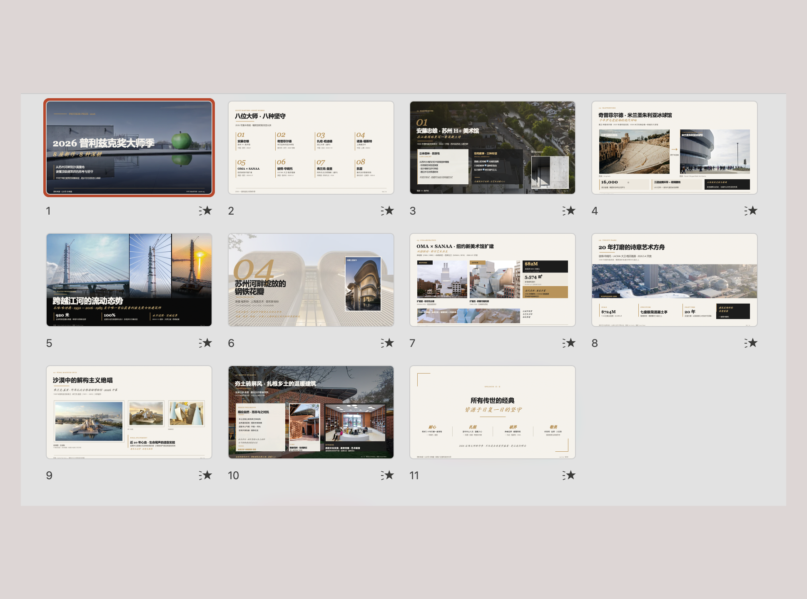
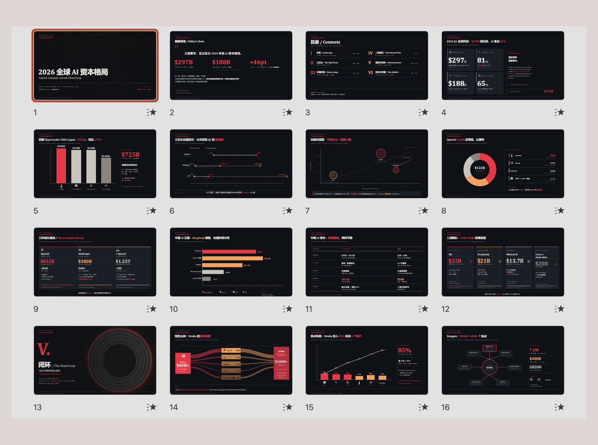
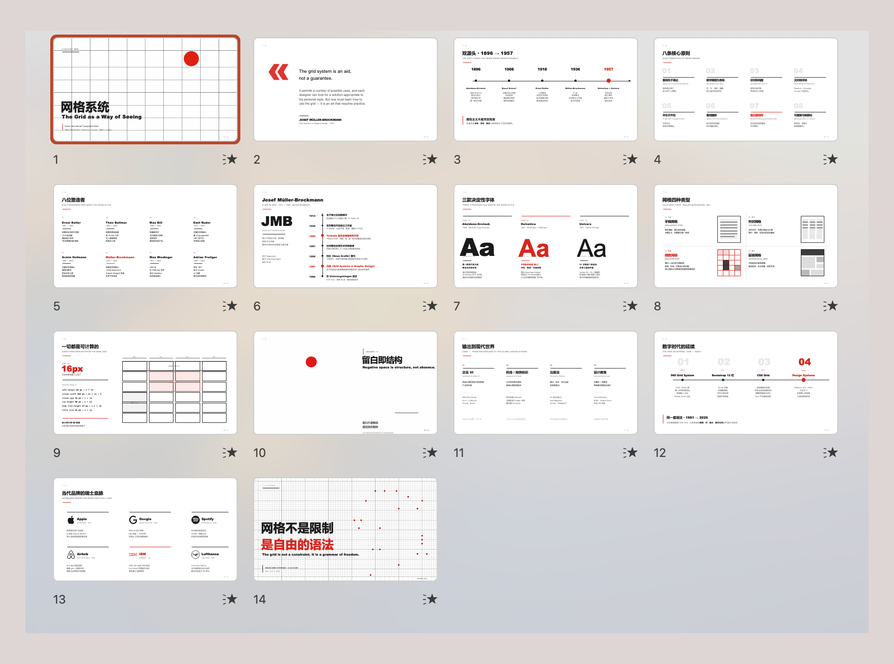
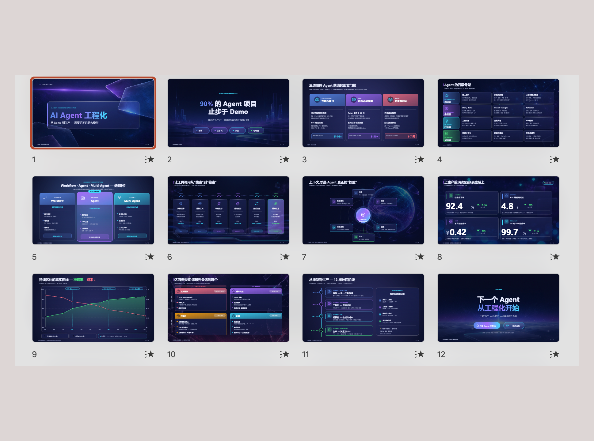
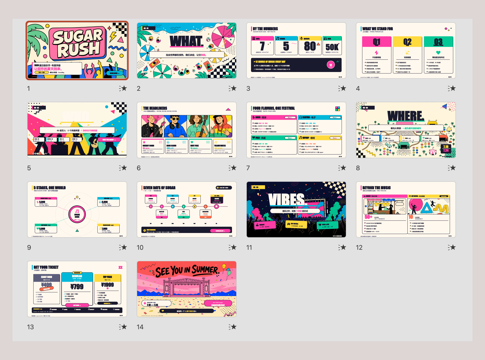
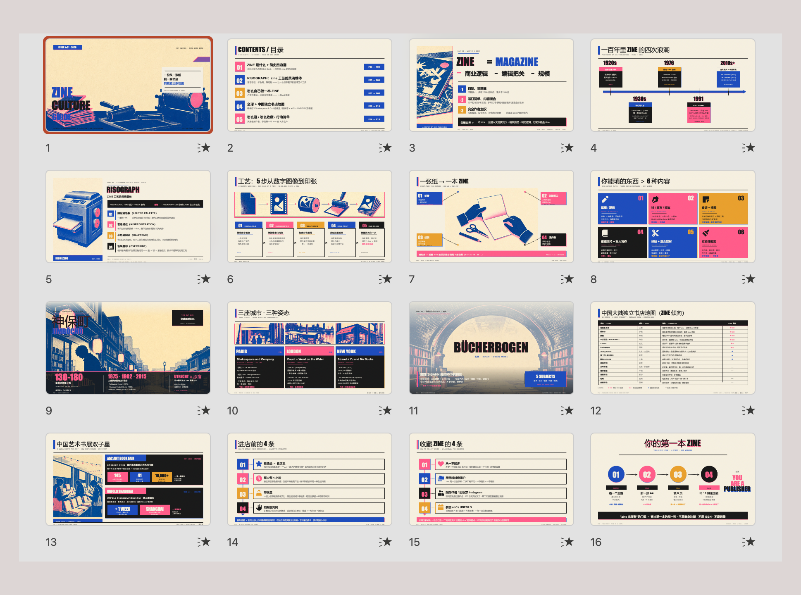

# PPT Master — AI 生成原生可编辑 PPTX，支持任意文档输入

[](https://opensource.org/licenses/MIT)

[English](./README.md) | 中文

<p align="center">
  <a href="./examples/"><strong>示例下载</strong></a> ·
  <a href="./docs/zh/faq.md"><strong>常见问题</strong></a> ·
  <a href="./docs/zh/roadmap.md"><strong>路线图</strong></a>
</p>

<h3 align="center">在 PowerPoint 里直接打开 .pptx 是最快感受这个项目能力边界的方式。看看下面的示例效果：</h3>

<table>
  <tr>
    <td align="center" width="33%">
      <br/>
      <sub><b>杂志风</b> — 建筑摄影 + 排版网格，冷静克制的编辑感</sub>
    </td>
    <td align="center" width="33%">
      <br/>
      <sub><b>新闻 / 财经数据风</b> — 深色仪表盘，图表驱动，彭博风</sub>
    </td>
    <td align="center" width="33%">
      <br/>
      <sub><b>瑞士风</b> — 严格栅格，克制字体，红色点缀</sub>
    </td>
  </tr>
  <tr>
    <td align="center" width="33%">
      <br/>
      <sub><b>毛玻璃 SaaS</b> — 半透明叠层，渐变景深，产品 UI 感</sub>
    </td>
    <td align="center" width="33%">
      <br/>
      <sub><b>孟菲斯波普</b> — 高饱和原色，几何图形，俏皮活力</sub>
    </td>
    <td align="center" width="33%">
      <br/>
      <sub><b>Risograph Zine</b> — 双色印刷质感，手作书店文化</sub>
    </td>
  </tr>
</table>

<p align="center">
  <sub><a href="./examples/"><code>examples/</code> 目录</a> · <a href="./docs/zh/why-deepppt.md">为什么选 PPT Master？</a></sub>
</p>

---

丢进你的原材料，拿回的是一份**真正的 PowerPoint**：可以直接修改，有 PPT 原生的转场与入场动画，演讲者备注能合成音频旁白，还能参考你自己的 PPT 模板——一份能直接拿去讲、回头还能改的真 PPT。每项能力怎么用 → [快速入门](./docs/zh/getting-started.md)。

> **⚠️ PPT Master 是 harness，不是完整的 agent。** `harness + model = agent`——工具负责工作流，模型决定上限。要组成真正高质量的 agent，推荐组合是：**Claude 大上下文窗口（~100 万 token）+ AI 生图（`gpt-image-2`）**。其他模型能跑流程，但达不到同等质量上限。效果不理想，请先换模型，不要质疑 harness。

> **运作方式** —— PPT Master 是一套在 AI IDE（Claude Code / Cursor / VS Code + Copilot / Codebuddy 等）里运行的工作流（一个 "skill"）。你在 IDE 的对话框里跟 AI 说"用这份 PDF 做一份 PPT"，AI 按这套工作流在你本机生成一个真正可编辑的 `.pptx`。你不写任何代码——IDE 只是你和 AI 对话的地方。
>
> **你要做的**：装 Python、装一个 AI IDE、把资料放进来。

> **为什么是这种形态** —— 未来，使用 Python 和 AI agent 的能力会越来越重要。这个项目就是要展示：仅凭这两样，你能走多远。代价是零基础上手有一段学习曲线，但走完这段，你就接上了未来。

PPT Master 不一样：

- **真正的 PPT** — 如果一个文件在 PowerPoint 里打不开、不能编辑，它就不应该被叫做 PPT。PPT Master 输出的每个元素都能直接点击修改
- **成本透明可控** — 工具免费开源，唯一成本是你自己的 AI 模型用量。当前主流 AI 工具都已转向按量计费，你用多少付多少——PPT Master 不在此之外增加任何额外订阅费用
- **数据不出本地** — 你的文件不应该为了做一份 PPT 就被上传到别人的服务器。除与 AI 模型的对话外，全流程在你的电脑上完成
- **不锁定平台** — 你的工作流不应该被任何一家公司绑架。Claude Code、Cursor、VS Code Copilot 等均可驱动；Claude、GPT、Gemini、Kimi 等模型均可使用

市面上的 AI PPT 工具大致分四类，PPT Master 只做最后一类：

| 类型 | 产物形态 | 能在 PowerPoint 里逐元素改吗 |
|---|---|:---:|
| 模板填空 | 套模板的 PPTX | 部分可以，受模板限制 |
| 图片式 | 一页一张大图拼成 PPTX | ❌ 整页是图片 |
| HTML 演示 | 网页演示 | ❌ 不是 PPTX |
| **原生可编辑（PPT Master）** | **真 DrawingML 形状、文本框、图表** | ✅ 每个元素都能点开改 |

---

## 快速开始

### 1. 前置条件

**只需装 Python 即可。** 其余依赖通过 `pip install -r requirements.txt` 一次装齐。

| 依赖 | 是否必须 | 用途 |
|------|:--------:|------|
| [Python](https://www.python.org/downloads/) 3.10+ | ✅ **必需** | 核心运行时——唯一真正需要安装的东西 |

> **一句话总结** — 装好 Python，跑一行 `pip install -r requirements.txt`，就可以开始生成 PPT 了。

<details open>
<summary><strong>Windows</strong> — 请看专门的手把手安装指南 ⚠️</summary>

Windows 需要一些额外步骤（PATH 设置、执行策略等）。我们为 Windows 用户写了一份**手把手安装指南**：

**📖 [Windows 安装指南](./docs/zh/windows-installation.md)** — 从零到跑通第一份 PPT，10 分钟搞定。

简要流程：从 [python.org](https://www.python.org/downloads/) 下载 Python → **安装时勾选 "Add to PATH"** → `pip install -r requirements.txt` → 完成。
</details>

<details>
<summary><strong>macOS / Linux</strong> — 安装即用</summary>

```bash
# macOS
brew install python
pip install -r requirements.txt

# Ubuntu / Debian
sudo apt install python3 python3-pip
pip install -r requirements.txt
```
</details>

<details>
<summary><strong>边缘场景备用方案</strong> — 99% 的用户用不到</summary>

**Pandoc** — 只在需要转小众格式时才装：`.doc`、`.odt`、`.rtf`、`.tex`、`.rst`、`.org`、`.typ`。`.docx`、`.html`、`.epub`、`.ipynb` 已由 Python 原生处理，不需要 pandoc。

```bash
# macOS
brew install pandoc

# Ubuntu / Debian
sudo apt install pandoc
```
</details>

### 2. 选择一个 Agent

PPT Master 在**任何具备 agent 能力**（可读写文件、执行命令、持续多轮对话）的工具里都能跑。

| 类型 | 代表工具 | 说明 |
|---|---|---|
| **IDE 内置 agent** | • VS Code 架构（含 [VS Code](https://code.visualstudio.com/) 本体及分支与衍生）：[Cursor](https://cursor.sh/)、Trae、Codebuddy IDE、[Windsurf](https://codeium.com/windsurf)、Void 等<br>• 其他架构：[Zed](https://zed.dev/) 等 | 编辑器原生集成 agent |
| **IDE 插件 / 扩展** | [GitHub Copilot](https://github.com/features/copilot)、[Claude Code](https://claude.ai/code)（VS Code / JetBrains 扩展）、[Cline](https://cline.bot/)、[Continue](https://continue.dev/)、Roo Code、通义灵码、CodeGeeX 等 | 装在 VS Code / JetBrains 等宿主里使用 |
| **CLI agent** | [Claude Code](https://claude.ai/code) CLI、[Codex CLI](https://github.com/openai/codex)、[Aider](https://aider.chat/)、Gemini CLI 等 | 终端里运行，适合脚本化 / 远程 / 服务器场景 |

> **模型推荐**：优先选 **Claude Opus / Sonnet**，搭配大上下文窗口和 `gpt-image-2` 生图——原因见上方说明。

### 3. 配置项目

**方式 A — 下载 ZIP**（无需安装 Git）：从项目仓库获取源码并解压。

**方式 B — Git clone**（需先安装 [Git](https://git-scm.com/downloads)）：

```bash
git clone <repository-url>
cd deepppt
```

然后安装依赖：

```bash
pip install -r requirements.txt
```

日常更新（方式 A / B）：`python3 skills/deepppt/scripts/update_repo.py`

> **方式 C — Skill marketplace**：仓库已添加 `.claude-plugin/marketplace.json` 元数据，可通过 [Claude Code plugin marketplace](https://code.claude.com/docs/en/plugin-marketplaces) 生态一行安装：
>
> ```bash
> # 跨 agent CLI（Claude Code、Cursor、Codex 等）
> npx skills add <repository-path>
>
> # 或在 Claude Code 内
> /plugin marketplace add <repository-path>
> /plugin install deepppt@deepppt
> ```
>
> 上述两种安装方式都只会拉取 skill 文件本身（不含完整仓库），后处理脚本仍需在安装目录跑 `pip install -r requirements.txt`。

### 4. 开始创作

**提供原始材料（推荐）：** 将 PDF、DOCX、图片等文件放入 `projects/` 目录下，在 AI 聊天面板中告诉它使用哪些文件。获取路径的最快方式：在文件管理器或 IDE 侧边栏中右键文件 → **复制路径**（Copy Path / Copy Relative Path），直接粘贴进聊天框。

```
你：请用 projects/q3-report/sources/report.pdf 这份文件生成一份 PPT
```

**直接输入内容：** 也可以把文字内容直接粘贴进聊天窗口，AI 会根据这些内容生成 PPT。

```
你：请根据以下内容制作成 PPT：[粘贴你的文字内容...]
```

两种方式下 AI 都会先确认设计规范：

```
AI：好的，先确认设计规范：
   [模板] B) 自由设计
   [格式] PPT 16:9
   [页数] 8-10 页
   ...
```

AI 全程处理——内容分析、视觉设计、SVG 生成、PPTX 导出。

> **输出说明：** 原生形状版 `.pptx`（可直接编辑）保存至 `exports/<name>_<timestamp>.pptx`；`svg_output/` 始终镜像到 `backup/<timestamp>/svg_output/`，便于归档或后续重跑。加 `--svg-snapshot` 时，额外在 `exports/` 内并排生成 SVG 快照版 pptx（详见[常见问题](./docs/zh/faq.md)）。需要 Office 2016+。

> **AI 迷失上下文？** 让它先读 `skills/deepppt/SKILL.md`。

> **遇到问题？** 查看 **[常见问题](./docs/zh/faq.md)** — 涵盖模型选择、排版问题、导出异常等，基于真实用户反馈持续更新。

### 5. 图片获取（可选）

非用户自带图片有两条路径，可在同一份 deck 里按行混用：

需要 API 的功能统一通过 `.env` 配置。clone 安装可以用 `cp .env.example .env`；skill marketplace 安装建议使用持久的用户级配置：

```bash
mkdir -p ~/.deepppt
cp /path/to/installed/deepppt/.env.example ~/.deepppt/.env
```

PPT Master 会优先读取当前进程环境变量，然后按顺序读取第一个存在的 `.env`：当前工作目录、clone 仓库根目录、`~/.deepppt/.env`。

**A) AI 生图** — `image_gen.py`。设置 `IMAGE_BACKEND` 和对应 `*_API_KEY`（`OPENAI_API_KEY`、`GEMINI_API_KEY` 等），流程会自动调用。`python3 skills/deepppt/scripts/image_gen.py --list-backends` 查看完整后端清单。`gpt-image-2` 目前综合质量最佳。

**B) 网络图片搜索** — `image_search.py`。**零配置**可用，但高质量使用建议配置 `PEXELS_API_KEY` / `PIXABAY_API_KEY`（都免费申请）。不配置时只使用 Openverse / Wikimedia Commons，适合作为兜底，但容易出现普通用户上传、构图随意、清晰度不稳定的图片；配置后默认搜索链会追加 Pexels / Pixabay，现代商业摄影、人物、办公、生活方式和插画类图片质量会明显更稳定。默认以图片质量和匹配度优先，直接把 CC0、公有领域、Pexels / Pixabay 免署名许可、CC BY、CC BY-SA 一起纳入候选；如果选中的图片需要署名，Executor 会在该幻灯片自动添加小字署名。只有明确不能出现署名时，才使用 `--strict-no-attribution` 限制为免署名图片。对视觉要求高的封面、产品图、人物图和品牌场景，优先级建议是：用户自带高清素材 / AI 生图 > 配置 Pexels / Pixabay 的网络搜索 > 零配置网络搜索。

> 完整说明：[`image-generator.md`](./skills/deepppt/references/image-generator.md)（AI）·[`image-searcher.md`](./skills/deepppt/references/image-searcher.md)（网络）。

---

## 文档导航

| | 文档 | 说明 |
|---|------|------|
| 📘 | [快速入门](./docs/zh/getting-started.md) | 三步做出第一份 deck，外加模板、实时预览、动画、旁白、声音复刻的用法（**新用户从这里开始**） |
| 🆚 | [为什么选 PPT Master](./docs/zh/why-deepppt.md) | 与 Gamma、Copilot 等工具的对比 |
| 🪟 | [Windows 安装指南](./docs/zh/windows-installation.md) | Windows 用户手把手安装教程 |
| 📖 | [SKILL.md](./skills/deepppt/SKILL.md) | 核心流程与规则 |
| 📐 | [画布格式](./skills/deepppt/references/canvas-formats.md) | PPT 16:9、小红书、朋友圈等 10+ 种格式 |
| 🛠️ | [脚本与工具](./skills/deepppt/scripts/README.md) | 所有脚本和命令 |
| 💼 | [示例](./examples/README.md) | 所有示例项目 |
| 🏗️ | [技术路线](./docs/zh/technical-design.md) | 架构、设计哲学、为什么选 SVG |
| ❓ | [常见问题](./docs/zh/faq.md) | 模型选择、费用、排版问题排查、自定义模板 |

---

## 贡献

详见 [CONTRIBUTING.md](./CONTRIBUTING.md)。

## 开源协议

[MIT](LICENSE)

## 致谢

[SVG Repo](https://www.svgrepo.com/) · [Tabler Icons](https://github.com/tabler/tabler-icons) · [Simple Icons](https://github.com/simple-icons/simple-icons) · [Phosphor Icons](https://github.com/phosphor-icons/core) · [Robin Williams](https://en.wikipedia.org/wiki/Robin_Williams_(author))（CRAP 设计原则）

---

MIT 协议。
