# 产品能力

- Source: `产品能力.pptx`
- Total slides: 8

## Slide 1

Atlas 850E服务器风冷超节点设备和灵衢总线设备及关键参数

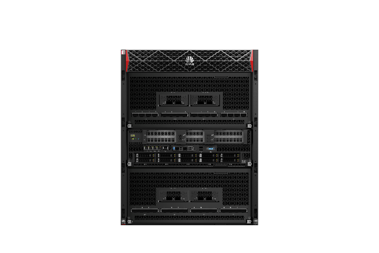

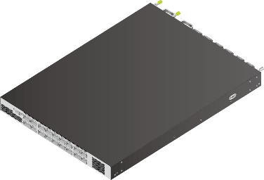

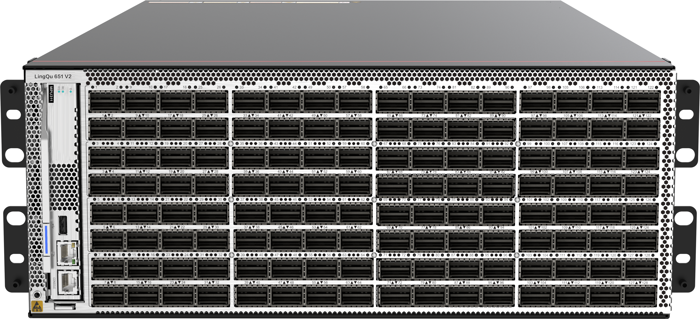

| 指标项 | Atlas 850E Server | LingQu 550 Box A交换机 | LingQu 550 Box B交换机 |
| --- | --- | --- | --- |
| 尺寸 | 14U
618.8mm(H)×447mm(W)×920mm(D) | 4U
442mm(W)*765mm(D)*175mm(H) | 1U
442mm(W)*600mm(D)*43.6mm(H) |
| 重量 | 整机251kg；
NPU抽屉46kg；CPU抽屉34kg；机框125kg | 55kg | 25kg |
| 功耗 | 16kW | 6kW | 1kW |
| 供电接口 | (6+6) *C19 | (3+3) *C13 | (1+1) *C13 |
| 工作温度 | 5℃～35℃ | 5℃～35℃ | 5℃～35℃ |
| 送回风温差 | ≤13℃ | ≤13℃ | ≤13℃ |
| UB网口 | 32*800GE | 128*800GE | 18*800GE |
| 备注 | 必选 | 必选 | 大于128卡超节点必选 |

### Speaker Notes

5808交换机和Unions交换机只是当前的设备代号，不是型号

1

## Slide 2

Atlas 850E 超节点服务器：面向企业级数据中心，匹配差异化方案

| 关键特性 | 规格描述 |   |
| --- | --- | --- |
| 形态 | 14U |   |
| CPU | 2 * 鲲鹏950 |   |
| NPU | 8 * 昇腾950DT |   |
| 尺寸 | 618.8mm(H)×447mm(W)×920mm(D) |   |
| 总算力 | 1.78P@mxFP4
918T @mxFP8
486T @FP16 | 1.55P @mxFP4
800T @mxFP8
425T @FP16 |
| 片上内存 | 支持8 * 84/96/144GB ，带宽最大4TB/s |   |
| 系统内存 | 支持24个DDR插槽，支持RDIMM，最高6400MT/s |   |
| 功耗 | 最大输入功耗15kW |   |
| 超平面规格 | 框内：8卡Fullmesh全互联，互联带宽784GB/s ，点对点带宽 >= 112GB/s
出框：任意2个NPU模组之间互联带宽>=800GB/s |   |
| 硬盘 | 2 * SATA 480GB
最大 8 * NVME 3.84TB/7.98TB |   |
| 网络接口 | UBoE配置：NPU直出，400Gbps (单向) UBoE 每/NPU
RoCE配置：400Gbps (单向) RoCE 每/NPU |   |
| PCIe接口 | 最多支持5个PCIe 5.0扩展插槽 |   |
| 电源 | 6个热插拔3.0 kW电源模块，支持5+1冗余 |   |

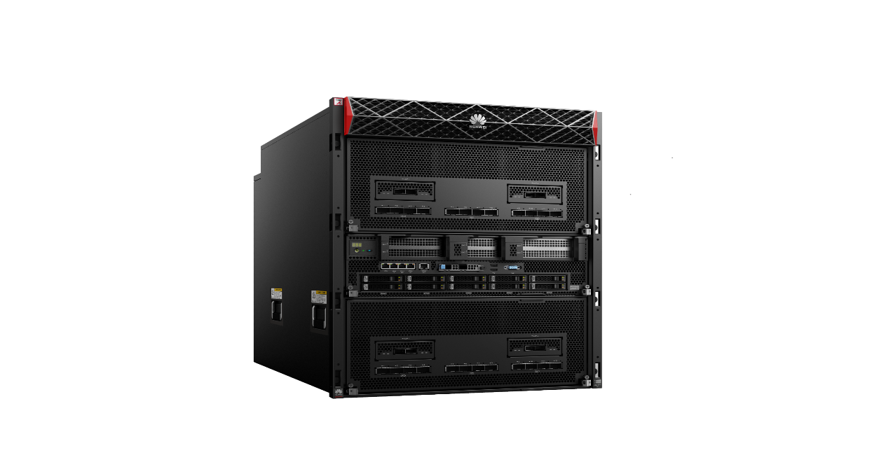

应用场景

优势

企业级智算中心

城市智算中心

校级算力中心

低精计算、通算融合、投机微调，达成主流 LLM类模型 TPOT<10ms

备注：算力为大致的范围，最终以正式上市为准

### Speaker Notes

2

## Slide 3

Atlas 850E 服务器硬件架构和整机规格

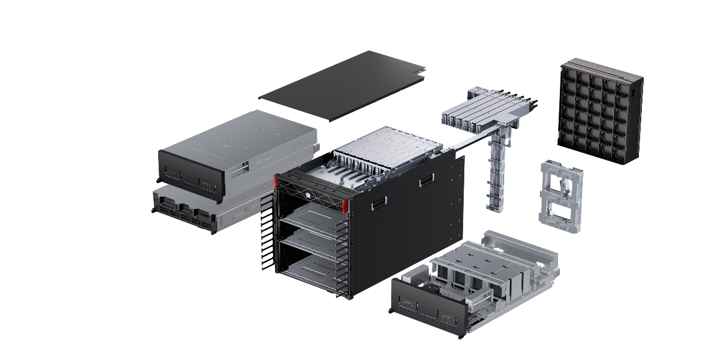

风扇墙

8双输入PSU

昇腾UB16超节点：共同定义，最佳亲和DS V4

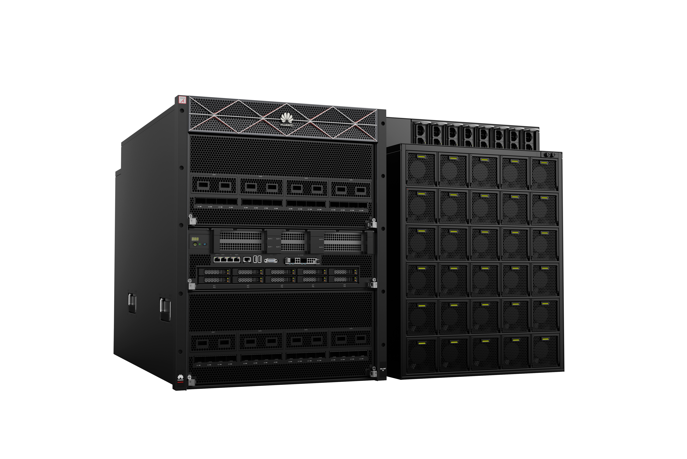

NPU抽屉

主打一体机场景，兼顾灵活部署和推理吞吐时延要求

后侧

前侧

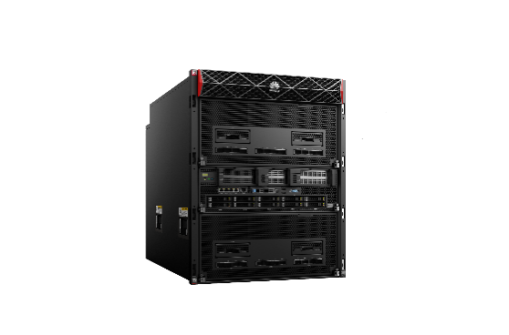

直连

2U：PSU

- 业界唯一全互联16卡EP
- 最佳匹配DeepSeek V4模型架构

2P CPU主板

2U：PSU

7口

4.5U：NPU

- T级参数大模型无压力
- 1.5TB+片上内存 @4TB/s

12U：风扇墙

8口

3U：CPU

- 背靠背直联免交换机
- 16卡UB Full-mesh

- 10ms低时延decode
- 高效投机解码+算子融合编译

Cable背板

4.5U：NPU

FP4量化推理 | MTP4/5投机 | SuperKernel …

10盘+6卡+0~1*OCP

4*HiAM 2.0模组

昇腾风冷超节点：以总线打以太，持续满足中心训推性能

主打中心推理低时延、单卡大并发、高吞吐场景

- 4*RNIC或
- 4*UBoE直通卡

16*OSFP

…

- 大模型FP4推理
- 2.5x MLU590，持平H200

灵衢设备

2.5x

2.5x

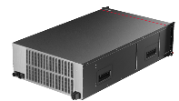

7口

唯一支持FP4

访存提升2倍+

最佳16卡并行

…

1.25x

1x

8口

- 1.78P FP4/卡
- 918T mxFP8/卡

- 4.0TB/s
- 整机768GB片上内存

- 1500+GB/s
- 15×UB口NPU间互联

UB

UB

UB

UB

UB

UB

UB

UB

7口full-mesh + 8口CLOS，支持32卡~1024卡超节点

灵活EP部署 | AF分离推理 | mxFP8训练 | RAS：软件快恢<1min，实例MTTR<7min …

- MLU590
- (INT8)

- A3
- (INT8)

- 850E
- （FP4）

- H200
- (FP8)

### Speaker Notes

3

## Slide 4

OceanStor A800：极致性能、多维扩展、AI原生的存储，打造AI时代最强存力

AI原生

极致性能

多维扩展

- EB级扩展
- 单集群Scale-out 512控制器

- 向量知识库
- 大库容多模向量检索

- 长记忆存储
- KV-Cache多级缓存

- 500 GB/s
- 每框 带宽

- 10,000,000
- 每框 IOPS

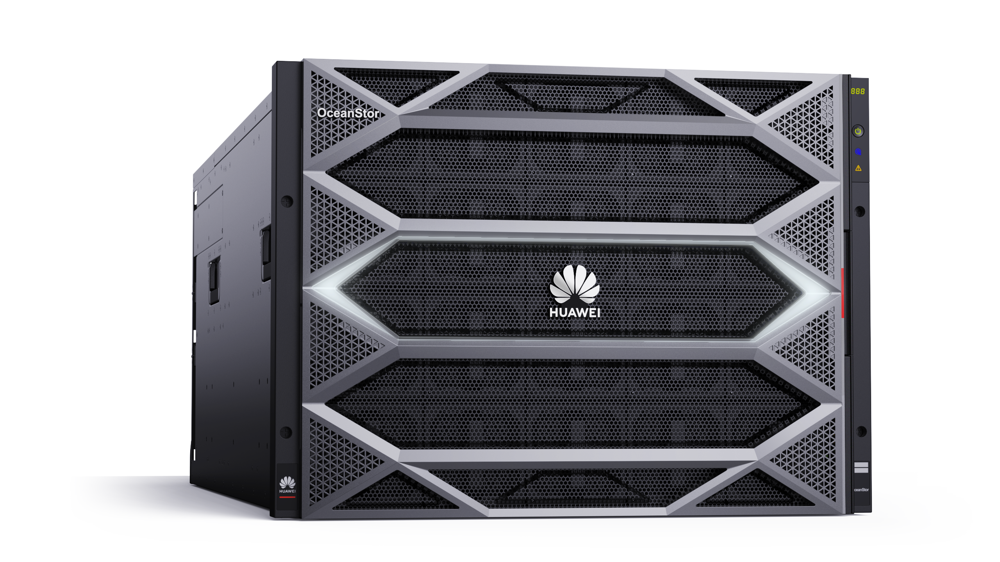

新一代数据存储，专为AI而生

OceanStor A800

* 路标支持

### Speaker Notes

* 2024年支持256控，25年支持512控

4

## Slide 5

| 防篡改 | 防泄露 | 防扩散 | 防入侵 |
| --- | --- | --- | --- |

安全备份：硬件级WORM技术防篡改，当备份软件被攻击后也能保证数据安全

硬件防篡改、灵活集成主流备份软件

生产数据

- 硬件WORM：触发或自动锁定，缺省保护周期
- 合规：特权用户不可(法规级)、可(企业级)删除WORM
- WORM文件系统集成：通过Commvault WORM Storage、NetBackup OST下发WORM锁定策略，实现和OceanProtect WORM集成
- 安全快照集成：安全快照兼容其他备份软件，实现硬件锁定

其他备份软件

Secure Snapshot

OST (WORM)

Worm Storage

业界最快的恢复速度

1

安全快照

WORM文件系统

写时自适应局部性整理技术，解决数据碎片多，导致读取变慢的问题，恢复速度5X友商（172TB/H）

备份资源池

A

C

E

H

G

B

I

D

F

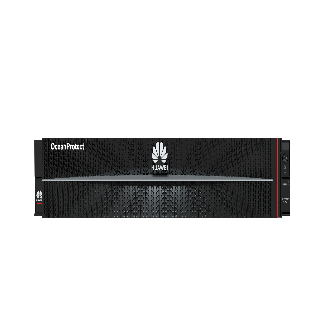

OceanProtect

3

内置安全可信，更可靠，更安全

1

3

5

8

7

2

9

4

6

实际盘上存储位置已随机打散

实际存储位置

| 指标 | 华为专用备份存储设备内置备份软件 | 3rd 备份软件+通用服务器 |
| --- | --- | --- |
| 可靠性 | √ 无单点故障 | × 无冗余设计 |
| 设备安全 | √可信启动->OS加固->中间件->组件环境隔离 | × |
| 功能安全 | √ 存储设备内置能力，OS攻破，不影响功能 | ×应用层能力，OS攻破后失效 |

写时自适应局部性整理技术

2

盘上读顺序

### Speaker Notes

5

## Slide 6

| 防篡改 | 防泄露 | 防扩散 | 防入侵 |
| --- | --- | --- | --- |

安全快照：主存提供关键数据的高频快照、秒级回滚、不可篡改

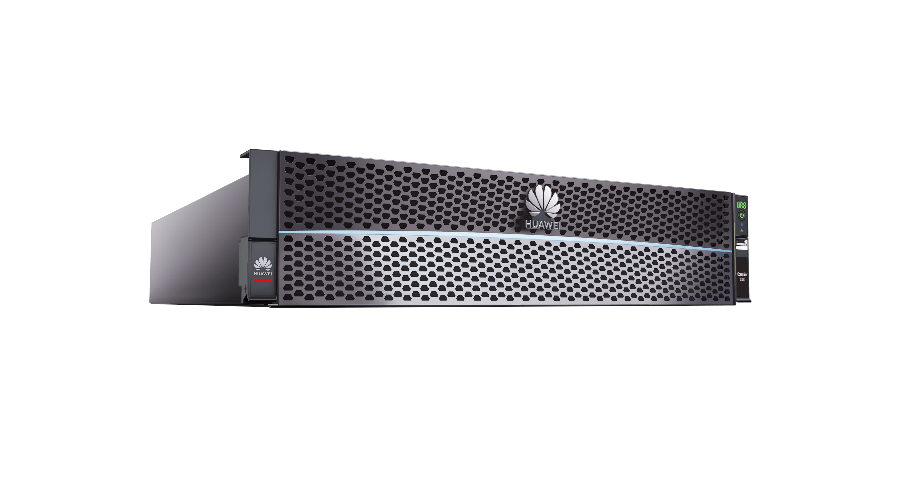

1

3

2

高频安全快照，缩短RPO时间

快照高速回滚，缩短RTO时间

安全快照防篡改，确保数据完整性

- 低RPO：采用HyperCDP时间点技术，缩短RPO时间，自动安全快照可达秒级；
- 低成本高性能：采用ROW技术，只涉及指针移动，不占用额外空间，性能损耗小

- RPO低：采用HyperCDP时间点分隔技术，实现快照高速回滚，数据恢复时间可缩短至秒级；
- RTO快：安全快照克隆创建立即可用，0等待

防破坏：防止非法提权后，恶意删除快照以及所依赖的文件系统\LUN

存储设备（主存）

加密生产数据场景

数据

2

秒级恢复能力

高频安全快照策略，降低RPO

1

恶意破坏快照副本场景

安全快照防篡改

3

## Slide 7

工具关键能力

- 轻量化底座 – 不依赖云底座，支持1PM昇腾共部署，高可靠3节点起
- 模型一键部署 – 屏蔽复杂性，模型分钟级部署
- 高可靠推理 – 负载均衡/限流，API高效可靠提供
- 建模仿真 – 训推超参仿真寻优，准确率90%+
- 推理业务可视 – 60+指标监控，资源&业务指标可视
- 智能解析与切片 – 12+切片算法，问答准确率90%+
- 知识图谱检索增强 – TOP N召回率90%+

ModelMate：一站式AI计算使能服务工具链

方案架构

AI数据工程使能服务

AI计算使能服务（含DS远程推理支持、RAG构建支持等）

…

- AI计算使能服务
- 配套轻量底座，提供训、推和RAG工具链

- 数据治理
- （ 解析 | 清洗 | 标注 | … ）

- 行业知识搜索
- （ 知识库构建 | 评测 | … ）

- 通用AI开发
- （ 开发 | 调测 | 训练 | … ）

- 模型推理
- （ 部署 | 监控 | … ）

运营商 …

- 面向通用AI开发场景：提供一站式AI模型开发部署工具链，FAE支持实现模型开发、调测、训练和推理部署，提升昇腾开发效率、降低昇腾开发门槛
- 面向DeepSeek场景：提供DeepSeek系列大模型微调\增训和模型网关和推理业务监控等
- 面向行业知识搜索场景：提供RAG应用工具链，FAE支持RAG方案设计、向量数据库和Embedding模型选型、RAG环境搭建、文档解析支持、向量化支持、RAG检索环境搭建等、知识库评测与优化(查询优化、检索优化等)

政府

金融

互联网

交通

能源

其他……

ModelMate

数据工程

应用工程

大模型训练数据处理及流水线工具链

知识库（RAG）构建与支持工具链

数据归集 | 数据清洗 | 数据标注 | 数据增强

智能切片 | 检索增强 | 安全护栏 | 分权分域

- 标准化
- 流水线

- 高质量
- 数据集

- 检索
- 准确率

- TOP N
- 召回率

模型工程

模型推理部署工具链

模型开发调测、训练/微调工具链

推理部署 | 模型服务 | 模型网关 | 推理可视

开发调测 | 模型训练 | 模型评测 | 训练可视

长稳训练

训练加速

性能

基础服务

可靠性

资源池管理 | 数据集管理 | 模型管理 | 镜像管理 | 租户管理 | …

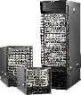

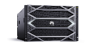

- 裸金属容器
- 资源管理、NPU池化

MindIE/vLLM

异构计算架构

AI存储（A800/A600）

CE/XH网络

注：数据工程配套AI数据使能服务，模型与应用工程配套AI计算使能服务

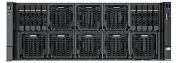

Atlas 800I A2/A3

## Slide 8

CCAE-lite：发挥算网存全域管理优势，保障推理业务可靠性

推理集群管理系统

全栈状态可观测

业务平台

运维平台

推理请求管理、业务管理、模型管理…...

集群管理、告警管理、日志管理、…...

全面指标管理

推理数字地图

- 全域资源管理
- 算/网/存/推理引擎/模型实例

- 4层 30+ KPI全覆盖
- 请求/实例/物理资源/逻辑资源

- 北向RESTful，Kafka
- 告警、性能、存量、故障、日志

集群自智引擎

基于全面KPI实时采集、资源综合建模实现全栈可视，基于业务日志和故障/性能数据智能诊断，覆盖CANN/OS/MindIE等软件栈典型故障，主动感知诊断业务故障/劣化

日常巡检

日常监控

故障感知定位

变更准入

业务运维

- 推理数字
- 地图

业务质量保障

极速故障诊断

中台运维

- 快速健康
- 评估

- 深度健康
- 评估

集群故障诊断

IT计算&网络运维

故障精准定位

全栈隐患一键排查

故障快速感知

大EP网络保障

- 70+隐患检查
- 深度压测、健康隐患巡检

- 1 分钟故障感知
- 业务故障、集群算网存故障

- 5 分钟故障定位
- NPU/端口/HCCL故障…

网络&存储

计算带内

计算带外

- MindIE、vLLM
- 推理引擎

CC-Agent

iBMC

提供完备的计算全生命周期部署、运维、升级支持。全面隐患排查，主动定时连接状态检测分析，主动保障集群运行质量

单机/双机/大EP

网络设备

存储设备

计算设备

* CCAE：Cluster Computing Autonomous Engine

### Speaker Notes

- 从使用场景看, CCAE支持对接业务平台和运维平台，支持标准北向restful和kafka协议上报数据。
- 运维能力上，CCAE面向三个不同的团队，第一是业务运维团队，也就是训练模型使用模型跑模型的业务团队，对业务团队来说是希望能及时发现业务有故障，及时的去处理故障，保障业务平稳。
- 第二个是中台运维，比如AI平台，如说提供大模型服务化容器化云化这部分。是一个承上启下的平台，承担着向业务提供一个统一的稳定的软硬一体的基础设施的职责；对中台部门需要有可管和防患于未然的能力；如何去判断集群的当前的状态，以及出了问题之后，与业务和IT团队的故障的定界，属于中台团队的职责。
- 最后是IT运维团队，传统的偏向硬件的这部分运维团队，CCAE提供四大块运维能力，包括日常监控，日常巡检，变更准入和故障感知定位。覆盖了生产作业的全流程。
- 面向各运维团队，CCAE构建两大类能力，第1类就是全栈的状态可观测。全站的资源看得清楚，有哪些资源，资源的状态是什么样的，资源现在的使用情况是健康还是不健康，是通过4层30加的KPI，全覆盖来提供全栈的状态可观测能力；
- 另外一部分就是极速的故障诊断，在出了问题的时候，能非常快速感知故障，能快速的去处理故障。包括前期的隐患排查，主动的故障感知以及故障发生之后的精准定位。通过这三个能力来支撑业务的高可靠性和运维的高效。

8
