# 解决方案能力

- Source: `解决方案能力.pptx`
- Total slides: 5

## Slide 1

DCS全栈数据中心解决方案：打造AI时代数据中心坚实底座

安全可靠

政府

金融

医疗

能源

运营商

交通

制造

教育

- 硬件亚健康自动迁移，环形3DC容灾业界唯一
- 存算网多层联动防勒索

智能管理层

DME 数据中心全栈管理

工具

全栈管理

智能运维

多租运营

云服务

- 迁移工具
- MigrationDirector

极致体验

智能数据

AI工具链

Data + AI

- 数据集成
- eCampusCore

- 大数据
- eDataInsight | EDS

- 数据治理
- iData

- 数据工程 | 模型工程 | 应用编排
- ModelEngine

- 部署工具
- SmartKit

- 软硬全栈优化， IO直通、E2E无损，性能优于业界10%+
- 全栈管理、智能运维，极简4步迁移

专业服务

eSphere资源池

灾备

安全

持续创新

资源层

- 虚拟化
- FusionCompute

- 容器
- eContainer

- 容灾 | 备份
- UltraVR | OceanProtect

- 防病毒 | 可信计算
- Anti-virus | vTPM

迁移服务

- AI工具链兼容百模千态，0代码应用编排，自动生成智能体
- 全流程数据平台，高效数据治理

规划实施

硬件层

计算

存储

网络

### Speaker Notes

- 有变内容
- Hlight

1

## Slide 2

| 防篡改 | 防泄露 | 防扩散 | 防入侵 |
| --- | --- | --- | --- |

网存协同检测，网络侧控制勒索病毒爆发、隔离潜伏病毒

数通EDR+存储，全网遏制勒索加密和扩散

客户价值

客户痛点

- 加密行为检测全网阻断：主存法案勒索病毒加密行为通知HiSec Insight，联动FW/EDR分钟级遏制病毒 (630，主存/数通安全)
- 备份潜伏病毒检测隔离：EDR检测备份病毒，5分钟内全网隔离（630，备份/数通安全）

超视界检测，终结逃逸

病毒绕过防护，无法发现

1

3

- 勒索软件绕过检测：采集主存加密行为，联动EDR发现绕过型勒索软件
- 恶意软件绕过检测：EDR周期扫描备份数据，用新签名发现历史潜伏病毒

- 0day恶意软件
- 主机EDR躲避技术（rookit、接管EDR驱动等）
- 未部署主机EDR

1

4

2

2

存储

主机

边界

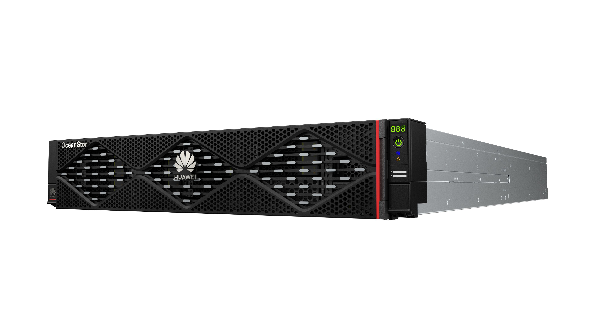

天级响应，难抵小时加密

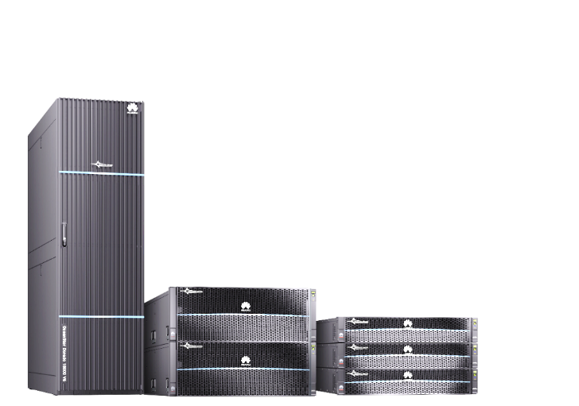

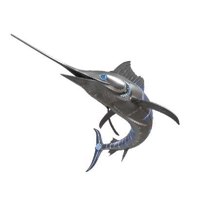

分钟级全网阻止勒索加密

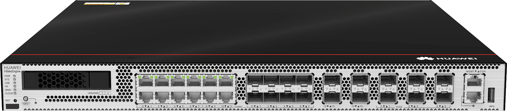

OceanProtect

入侵到全网加密时间：业界平均17h 、RansomHub缩至4-6h

- 端侧关闭进程、禁止文件执行、隔离主机；
- 网络侧阻断勒索文件传播

3

遏制

基于被加密文件，查询勒索文件

主力产品

EDR Sever

- 提取并上传
- 被加密文件hash

分钟级全网隔离潜伏病毒

潜伏病毒伺机而动，难清除

禁止勒索文件传输

静止勒索文件传播和执行

潜伏病毒扫描

USG防火墙

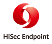

备份存储扫描节点，一点发现，全网隔离

4

全盘扫描耗费性能影响业务，默认不敢开启扫描，导致无法隔离

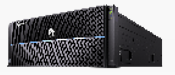

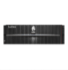

EDR Agent

内网FW

主存

备份

Dorado

### Speaker Notes

From Huntress《2025年威胁报告》

2

## Slide 3

华为AI存储解决方案：提供灵活扩展、极致性能、安全可靠的AI存储方案，提升集群利用率30%+，提升推理效率，加速AI全流程

+30%集群利用率提升

应用

自动驾驶

工业制造

智能客服

AI绘画

- 存储集群百TB/s带宽、亿级以上的IOPS；
- 数据加载、断点/故障恢复CKPT加载时长从半小时->10秒
- 万卡集群数据同步一致访问，99.9999% 可靠性
- 租赁场景支持多租户数据隔离、QoS等能力

计算和软件平台

模型推理

模型训练及评估

数据预处理

X86

英伟达

AI训练服务器（GPU/NPU/CPU）

K8S

…

客户自研平台

- 运维管理
- DME
- 数据管理
- 运维管理
- 安全管理

EB容量支持多模态、万亿参数模型

- 全对称512控扩展至EB级容量，数据存得下
- 多协议互通，数据0搬迁
- 一套存储支持AI全流程，数据全局可视、可管、可用

网络

200/100G RoCE交换机

- IP交换机
- 备份、分级、管理网络

主存网络

分布式架构文件系统、 DataTurbo客户端、GDS数据直通

数据处理（CPU）

存储硬件平台

长记忆存储推理加速

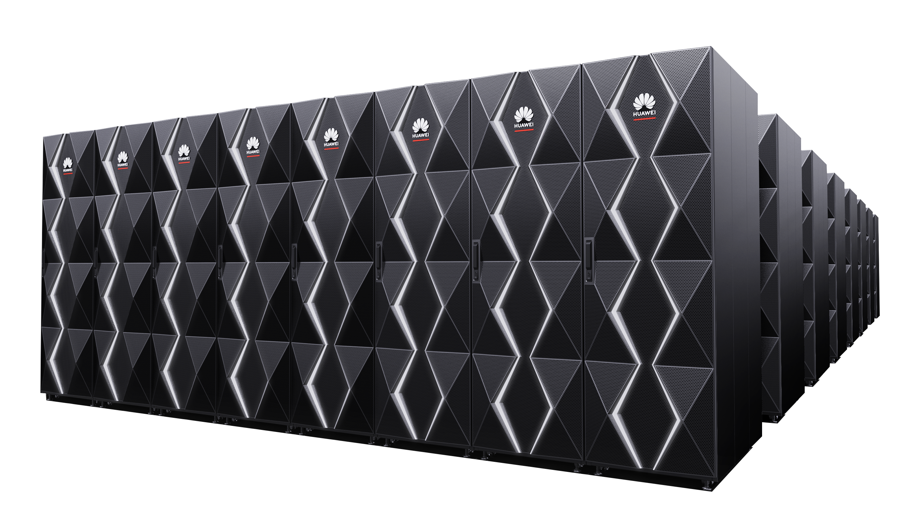

- KV-Cache多级缓存，以查代算，推理更高效，首Token时延最高降低90%+，推理吞吐量2倍提升
- 大库容RAG向量知识库，推理更精准， QPS性能业界领先，知识检索精度>95%

OceanStor A系列 存储集群

### Speaker Notes

3

## Slide 4

轻量化推理：围绕XClaw等场景，打造安全、高性能轻量化底座，输出参考架构

行业价值场景

关键竞争力规划

产品组合方案：轻量化推理

企业龙虾&客服

…

应用

轻量化推理

- 企业XClaw安全加固 （630）
- 防越权：TEE硬件级隔离；EDR访问控制和审计
- 堵漏洞、控访问：零信任接入，防火墙阻断
- 防投毒：企业Skill参考实现降风险
- KV Cache多级缓存提升推理性能：多级池化提高Prefix Cache命中率，TTFT降低50% ，吞吐提升60%（A2/A3 630，950DT 1130）
- FP4推理提性能，探索在行业场景落地，及联合伙伴商用引擎进一步提升性能（1130）

1

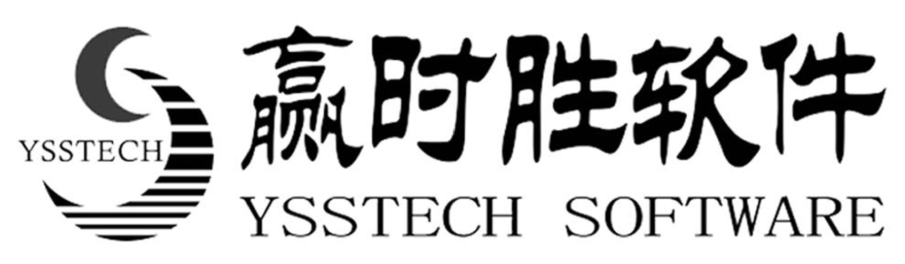

中小银行

证券

电力

检法

智能投研投顾

资产管理

AI辅助办案

XClaw（自主规划）

智能客服

智能营销

智能投研

智能投顾

辅助办案

通用Agent（基于业务流编排）

智慧运营

集成服务

OpenClaw | BoClaw | …

…

Agent平台

平台

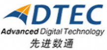

HiAgent | PowerAgent | …

自动部署工具 | 企业SkillHub

2

关键需求

3

2

1

鲲鹏TEE可信执行

存储UCM

vLLM-Ascend

安装部署服务

3

DCS 虚拟化 | 容器 | 运维

- OpenClaw爆火推动算力需求倍增，众多企业开始小规模试用，对安全有高要求
- DeepSeek V4支持1M上下文，长序列推理性价比大幅提升，亲和Claw场景

- XH6655
- 零信任FW

CE6885

CE8855

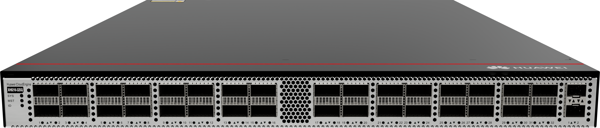

参考架构

算力底座

安全加固服务

100GE

25GE

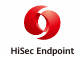

- 企业XClaw参考架构：适配DS V4，整体方案设计参考、参考实现、测试用例、集成环境等，使能伙伴快速构建Xclaw端到端方案能力（630）
- AI面客场景化方案设计参考：含业务流、典配、性能基线、性能调优等（630）
- 机房改造设计参考：面向伙伴提供轻量化推理场景的机房改造设计参考（630）

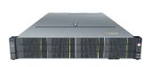

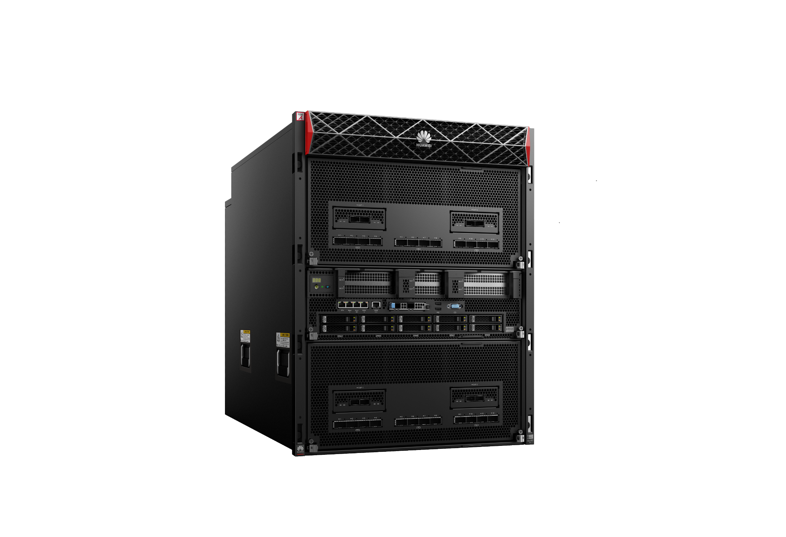

…

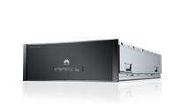

HiSec Endpoint

- 昇腾
- 800I A2/A3、850E

鲲鹏/Fusioncube

- OceanStor
- A600

- Skills
- 开发服务

证券基金

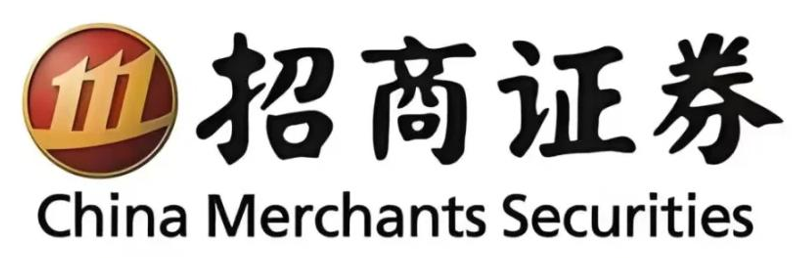

机房改造参考设计

金融等客户关注开箱性能，算力底座需适配伙伴应用，并协同优化推理性能

华为

伙伴/开源

| 场景 | 产品组合 |
| --- | --- |
| xClaw | Atlas 800I A2/A3，Atlas850E，Fusioncube1000H、AI存储，DCS，XH/CE交换机，XH6655防火墙，EDR，分析器HisecInsight |
| 多轮对话 | Atlas 800I A2/A3，Atlas850E，Fusioncube1000H、DCS，XH/CE交换机，CCAE Lite |

政府检法

典型项目

辅助办案等长序列推理场景对吞吐性能要求高，ISV伙伴需华为提供参考设计与性能基线

- 金融：招商证券、光大银行
- 政府检法：最高检、龙岗政数局

### Speaker Notes

1、RAG和Agent

4

## Slide 5

LightAI：长序列复杂推理场景，存算协同让算力资源池“推得动、推得快、推得省”

场景与痛点

方案亮点

存算协同AI存储推理加速

  - 推得动：
  - 持久化保存KV Cache，突破NPU/GPU显存限制，提升3倍以上的上下文窗口长度

典型场景

- 投行报告
- 单次输入>6万token

- 尽职调查
- 单次输入>3万token

- 投研分析
- 单次输入>10万token

证券投研分析、投行报告生成等长序列复杂推理场景，推理性能差、成本高

  - 推得快：
- 32K长序列推理并发提升2倍，首Token时延降低90%，吞吐提升1倍

- 计
- 算

NPU/GPU

NPU/GPU

… …

L1：HBM层 KV Cache

客户痛点

78s

长记忆推理存储

- 存储DPC客户端
- L2：DRAM层 KV Cache缓存

22

4

10s

11

无推理存储

2

  - 推不动
  - 输入序列长度超过大模型上下文窗口，推理无法启动
  - 推得慢
  - 序列越长，推理并发/吞吐越低，推理服务器繁忙
  - 推得贵
  - 序列越长，需要的HBM容量越大，需要堆更多推理服务器

有推理存储

- L3：SSD层
- KV Cache持久化

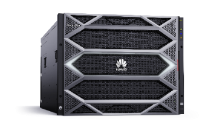

推理并发

首token时延

推理吞吐(token/s)

OceanStor A系列存储

  - 推得省：
- 持久化大容量KV Cache，命中率超过50%，避免50%+重算
- 相同容量SSD的成本相比显存降低120倍

### Speaker Notes

- HBM->DRAM->SSD三层KV分级缓存，和以查代算关键技术，为大模型提供终身记忆和无限上下文能力，提升推理精度和性能；
- 采用NDS，实现HBM和显存直通访问，数据加载时延降低1+倍。
- 对接vLLM/MindIE等主流的推理引擎，实现多层调度协同；

5
